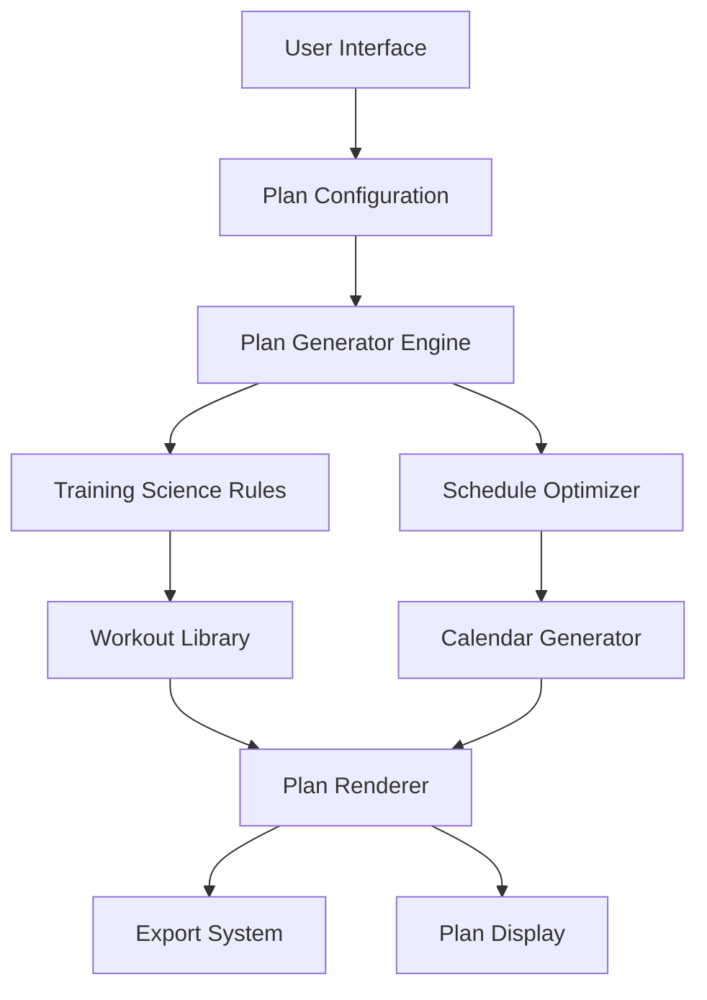

# Design Document

## Overview

The Running Plan Generator is a client-side web application that generates personalized training plans using established running science principles. The system uses a rule-based algorithm to create periodized training plans that balance different workout types, incorporate proper recovery, and scale appropriately for different race distances and user preferences.

**Measurement System**: The application is designed with the metric system as the primary and only supported unit system. All distances are calculated and displayed in kilometers and meters, paces in minutes per kilometer, and elevations in meters. Imperial unit support (miles, feet, minutes per mile) is planned for future implementation but is explicitly excluded from the current design scope to maintain simplicity and consistency.

## Key Considerations

### Science-Based Principles to Implement

**Gradual Progression**
- No more than 10% weekly mileage increase to prevent injury
- Built-in safety caps for volume increases
- Automatic adjustment for aggressive progression attempts

**Polarized Training (80/20 Rule)**
- 80% of training at easy/aerobic intensity (Zone 1-2)
- 20% of training at moderate/hard intensity (Zone 3-5)
- Strict adherence to intensity distribution for optimal adaptation

**Adequate Recovery Between Quality Sessions**
- Minimum 48 hours between high-intensity workouts
- Strategic placement of easy runs and rest days
- Recovery validation to prevent overtraining

**Periodization with Distinct Phases**
- Base Phase: Aerobic development and injury prevention
- Build Phase: Lactate threshold and VO2 max development  
- Peak Phase: Race-specific fitness and sharpening
- Taper Phase: Recovery while maintaining fitness

**Proper Tapering Before Race Day**
- Volume reduction (20-30%) in final 2-3 weeks
- Maintained intensity to preserve fitness
- Strategic rest day placement before race

### User Experience Priorities

**Simple, Intuitive Configuration**
- Minimal required inputs with smart defaults
- Clear visual feedback for parameter changes
- Progressive disclosure of advanced options

**Clear Visualization of the Plan**
- Weekly calendar view with workout summaries
- Visual indicators for workout types and intensity
- Progress tracking and phase identification

**Mobile-Responsive Design**
- Touch-friendly interface elements
- Optimized layouts for small screens
- Consistent experience across devices

**Ability to Modify and Regenerate**
- Real-time plan updates when parameters change
- Easy comparison between plan versions
- Undo/redo functionality for configuration changes

**Educational Tooltips Explaining Workout Purposes**
- Training benefits for each workout type
- Scientific rationale for plan structure
- Guidance on effort levels and pacing

## Architecture

### System Architecture



### Technology Stack

- **Frontend Framework**: Vue 3 with TypeScript
- **Build Tool**: Vite with vue-ts template
- **State Management**: Vue 3 Composition API with reactive state
- **Data Storage**: Browser localStorage for user preferences
- **Export**: Client-side PDF generation and calendar formatting
- **Styling**: TailwindCSS with DaisyUI component library
- **Type Safety**: Full TypeScript implementation throughout

### Frontend Structure

```
src/
  components/
    configurator/
      - ProgramLengthSlider.vue
      - RaceDistanceSelector.vue
      - TrainingDaysSelector.vue
      - RestDayPicker.vue
      - LongRunDaySelector.vue
      - DeloadFrequencyToggle.vue
      - DifficultySelector.vue
      - PaceInputWizard.vue
      - RecentRaceInput.vue
      - PaceZonesDisplay.vue
    plan-display/
      - CalendarView.vue
      - WeeklyCard.vue
      - WorkoutDetail.vue
      - ProgressChart.vue
    export/
      - PDFGenerator.vue
      - CalendarExport.vue
  composables/
    - usePlanGenerator.ts
    - useWorkoutCalculator.ts
    - useProgressionRules.ts
    - useValidationRules.ts
    - useDifficultyAdjustments.ts
    - useVdotCalculator.ts
    - usePaceCalculator.ts
    - useAdaptivePaceSystem.ts
  types/
    - trainingPlan.ts
    - workout.ts
    - configuration.ts
    - pace.ts
  constants/
    - trainingZones.ts
    - raceDistances.ts
    - workoutTypes.ts
    - difficultyLevels.ts
    - paceInputMethods.ts
  stores/
    - planStore.ts
    - configStore.ts
```

## Components and Interfaces

### 1. Plan Configuration Component

**Purpose**: Captures user preferences and validates input parameters

**Interface**:
```typescript
interface PlanConfiguration {
  raceDistance: '5K' | '10K' | 'Half Marathon' | 'Marathon';
  programLength: number; // weeks
  trainingDaysPerWeek: number; // 3-7
  restDays: string[]; // ['Monday', 'Wednesday']
  longRunDay: string; // 'Saturday'
  deloadFrequency: 3 | 4; // weeks between deload
  userExperience: 'beginner' | 'intermediate' | 'advanced';
  difficulty: 'veryEasy' | 'easy' | 'moderate' | 'hard' | 'veryHard';
  paceMethod: 'recentRace' | 'timeTrial' | 'currentPace' | 'goal' | 'fitnessLevel';
  paceData: PaceData;
}

interface PaceData {
  method: string;
  inputData: any; // Race time, current pace, etc.
  calculatedPaces: TrainingPaces;
  vdot?: number;
}

interface TrainingPaces {
  recovery: PaceRange;
  easy: PaceRange;
  marathon: PaceRange;
  threshold: PaceRange;
  interval: PaceRange;
  repetition: PaceRange;
}

interface PaceRange {
  minPace: number; // seconds per kilometer
  maxPace: number; // seconds per kilometer
  targetPace: number; // seconds per kilometer
}
```

### 6. Base Pace Determination System

**Purpose**: Establishes personalized training paces using multiple input methods with VDOT-based calculations

**Pace Input Methods** (Priority Order):
```typescript
const paceInputMethods = {
  recentRace: {
    priority: 1,
    accuracy: "highest",
    description: "Most accurate - based on actual performance",
    icon: "📊"
  },
  timeTrial: {
    priority: 2,
    accuracy: "high", 
    description: "5K or 3K time trial for current fitness",
    icon: "⏱️"
  },
  currentTrainingPace: {
    priority: 3,
    accuracy: "moderate",
    description: "Average easy run pace from recent training",
    icon: "🏃"
  },
  goalTime: {
    priority: 4,
    accuracy: "low",
    description: "Least accurate - aspirational",
    icon: "🎯"
  },
  fitnessLevel: {
    priority: 5,
    accuracy: "estimate",
    description: "Rough estimate based on experience level",
    icon: "📝"
  }
};
```

**VDOT Calculator** (Jack Daniels' System):
```typescript
class VDOTCalculator {
  constructor(raceDistance, raceTime) {
    this.vdot = this.calculateVDOT(raceDistance, raceTime);
    this.trainingPaces = this.generateTrainingPaces(this.vdot);
  }
  
  calculateVDOT(distance, timeInSeconds) {
    const distanceInMeters = this.convertToMeters(distance);
    const velocity = distanceInMeters / timeInSeconds;
    
    // Oxygen cost calculation
    const vo2 = -4.6 + 0.182258 * velocity + 0.000104 * velocity * velocity;
    
    // Time coefficient for effort sustainability
    const timeCoef = 0.8 + 0.1894393 * Math.exp(-0.012778 * timeInSeconds / 60)
                      + 0.2989558 * Math.exp(-0.1932605 * timeInSeconds / 60);
    
    return vo2 / timeCoef;
  }
  
  generateTrainingPaces(vdot) {
    return {
      easy: this.vdotToPace(vdot, 0.65, 0.75),      // 65-75% of VO2max
      marathon: this.vdotToPace(vdot, 0.79, 0.80),   // 79-80% of VO2max
      threshold: this.vdotToPace(vdot, 0.86, 0.88),  // 86-88% of VO2max (Tempo)
      interval: this.vdotToPace(vdot, 0.97, 1.0),    // 97-100% of VO2max
      repetition: this.vdotToPace(vdot, 1.05, 1.10)  // 105-110% of VO2max
    };
  }
}
```

**Race Equivalency Calculator** (Riegel's Formula):
```typescript
const raceEquivalencyCalculator = {
  predictTime(knownDistance, knownTime, targetDistance) {
    const degradationFactor = 1.06; // Can be adjusted (1.06-1.08)
    return knownTime * Math.pow(targetDistance / knownDistance, degradationFactor);
  },
  
  generateEquivalentTimes(inputDistance, inputTime) {
    const distances = {
      "5K": 5000,
      "10K": 10000,
      "halfMarathon": 21097,
      "marathon": 42195
    };
    
    const equivalents = {};
    const inputMeters = distances[inputDistance];
    
    for (const [race, meters] of Object.entries(distances)) {
      equivalents[race] = this.predictTime(inputMeters, inputTime, meters);
    }
    
    return equivalents;
  }
};
```

**Adaptive Pace System** (Environmental Adjustments):
```typescript
class AdaptivePaceSystem {
  constructor(initialPaces) {
    this.basePaces = initialPaces;
  }
  
  adjustForConditions(workout, conditions) {
    let paceAdjustment = 1.0;
    
    // Temperature adjustment (Galloway's temperature adjustment)
    if (conditions.temperature > 60) {
      const degreesAbove60 = conditions.temperature - 60;
      paceAdjustment *= 1 + (degreesAbove60 / 5 * 0.02);
    }
    
    // Altitude adjustment (metric)
    if (conditions.altitude > 900) { // 900 meters ≈ 3000 feet
      const metersAbove900 = conditions.altitude - 900;
      paceAdjustment *= 1 + (metersAbove900 / 300 * 0.02); // 300m ≈ 1000ft
    }
    
    // Training phase adjustment
    const phaseAdjustments = {
      base: 1.05,      // 5% slower in base phase
      build: 1.02,     // 2% slower in early build
      peak: 1.0,       // Target pace in peak
      taper: 0.98      // 2% faster feel in taper
    };
    
    paceAdjustment *= phaseAdjustments[conditions.phase] || 1.0;
    
    return {
      ...workout,
      adjustedPace: workout.targetPace * paceAdjustment,
      adjustmentNote: this.generateAdjustmentNote(paceAdjustment, conditions)
    };
  }
}
```

**Workout Pace Assignment**:
```typescript
class WorkoutPaceAssignment {
  constructor(userPaces, workoutType) {
    this.paces = userPaces;
    this.workoutType = workoutType;
  }
  
  assignPaceToWorkout(workout) {
    const paceMapping = {
      'easy': {
        pace: this.paces.easy,
        instruction: "Conversational pace, should feel comfortable"
      },
      'long': {
        pace: this.paces.easy,
        instruction: "Start at easy pace, can progress to marathon pace in later weeks"
      },
      'tempo': {
        pace: this.paces.threshold,
        instruction: "Comfortably hard, sustainable for 20-60 minutes"
      },
      'intervals': {
        pace: this.paces.interval,
        instruction: "Hard but controlled, 5K race pace (min/km)"
      },
      'hills': {
        pace: this.paces.interval,
        instruction: "Focus on effort rather than pace due to incline (min/km)"
      },
      'marathon': {
        pace: this.paces.marathon,
        instruction: "Goal marathon race pace"
      },
      'recovery': {
        pace: this.paces.easy,
        instruction: "Very easy, slower than normal easy pace"
      }
    };
    
    const mapping = paceMapping[workout.type];
    
    return {
      ...workout,
      targetPace: mapping.pace.targetPace,
      paceRange: {
        min: mapping.pace.minPace,
        max: mapping.pace.maxPace
      },
      paceInstruction: mapping.instruction,
      displayPace: this.formatPaceDisplay(mapping.pace.targetPace)
    };
  }
}
```

### Difficulty Adjustment System

**Purpose**: Allows fine-tuning of training load based on user capabilities and goals

**Difficulty Levels**:
```typescript
const difficultyLevels = {
  veryEasy: {
    multiplier: 0.7,
    label: "Recovery/Base Building",
    description: "Lower volume, more recovery, gentler progression",
    icon: "🌱",
    color: "#10b981"
  },
  easy: {
    multiplier: 0.85,
    label: "Conservative",
    description: "Safe progression, extra recovery",
    icon: "🏃",
    color: "#22c55e"
  },
  moderate: {
    multiplier: 1.0,
    label: "Standard",
    description: "Typical training load for target race",
    icon: "⚡",
    color: "#3b82f6"
  },
  hard: {
    multiplier: 1.15,
    label: "Aggressive",
    description: "Higher volume, faster progression",
    icon: "🔥",
    color: "#f59e0b"
  },
  veryHard: {
    multiplier: 1.3,
    label: "Advanced/Competitive",
    description: "High volume, demanding workouts",
    icon: "💪",
    color: "#ef4444"
  }
};
```

**Difficulty Adjustments**:
```typescript
function adjustWorkoutByDifficulty(baseWorkout: Workout, difficultyLevel: string): Workout {
  const adjustments = {
    veryEasy: {
      volume: 0.7,          // 30% less volume
      intensity: 0.95,      // 5% slower paces
      recoveryTime: 1.5,    // 50% more recovery
      workoutsPerWeek: -1,  // One less quality session
      progressionRate: 0.05 // 5% weekly increase instead of 10%
    },
    easy: {
      volume: 0.85,
      intensity: 0.97,
      recoveryTime: 1.25,
      workoutsPerWeek: 0,
      progressionRate: 0.07
    },
    moderate: {
      volume: 1.0,
      intensity: 1.0,
      recoveryTime: 1.0,
      workoutsPerWeek: 0,
      progressionRate: 0.10
    },
    hard: {
      volume: 1.15,
      intensity: 1.02,
      recoveryTime: 0.9,
      workoutsPerWeek: 0,
      progressionRate: 0.12
    },
    veryHard: {
      volume: 1.3,
      intensity: 1.03,
      recoveryTime: 0.8,
      workoutsPerWeek: +1,
      progressionRate: 0.15
    }
  };
  
  return applyAdjustments(baseWorkout, adjustments[difficultyLevel]);
}
```

**Key Methods**:
- `validateConfiguration()`: Ensures parameters are physiologically sound
- `getRecommendations()`: Provides suggested values based on race distance
- `savePreferences()`: Persists user preferences to localStorage

### 2. Training Science Rules Engine

**Purpose**: Encodes running science principles and workout distribution logic

**Core Principles**:
- **80/20 Rule**: 80% easy/aerobic, 20% moderate/hard intensity (strict adherence)
- **Progressive Overload**: Maximum 10% weekly increase with safety caps
- **Periodization**: Base building → Build → Peak → Taper phases with distinct characteristics
- **Recovery Integration**: Minimum 48 hours between quality sessions
- **Tapering Protocol**: 20-30% volume reduction in final 2-3 weeks

**Interface**:
```typescript
interface TrainingRules {
  getWorkoutDistribution(raceDistance: string, weeks: number): WorkoutDistribution;
  calculateWeeklyVolume(week: number, totalWeeks: number, raceDistance: string): number;
  determineWorkoutTypes(phase: TrainingPhase, raceDistance: string): WorkoutType[];
  validateWorkoutSequence(workouts: Workout[]): ValidationResult;
}
```

### 3. Workout Library

**Purpose**: Defines workout templates and intensity guidelines with detailed progressions

**Detailed Workout Types**:

**Tempo Runs** (Zone 3-4, 85-90% max HR):
```typescript
const tempoProgression = {
  beginner: {
    early: "20 min @ tempo pace",
    mid: "2 x 15 min @ tempo w/ 2 min recovery",
    late: "30-35 min @ tempo pace"
  },
  intermediate: {
    early: "25 min @ tempo pace",
    mid: "3 x 12 min @ tempo w/ 2 min recovery",
    late: "40-45 min @ tempo pace"
  },
  advanced: {
    early: "30 min @ tempo pace",
    mid: "2 x 20 min @ tempo w/ 3 min recovery",
    late: "50-60 min @ tempo pace"
  }
};
```

**Interval Training** (Zone 5, 95-100% max HR):
```typescript
const intervalProgression = {
  "5k": {
    early: "6 x 400m @ 5K pace, 90s rest",
    mid: "5 x 800m @ 5K pace, 2 min rest",
    late: "4 x 1000m @ 5K pace, 2:30 rest",
    peak: "3 x 1600m @ 5K pace, 3 min rest"
  },
  "10k": {
    early: "8 x 400m @ 5K pace, 90s rest",
    mid: "6 x 800m @ 5-10K pace, 2 min rest",
    late: "5 x 1200m @ 10K pace, 2:30 rest",
    peak: "3 x 2000m @ 10K pace, 3 min rest"
  },
  "halfMarathon": {
    early: "6 x 800m @ 10K pace, 2 min rest",
    mid: "4 x 1600m @ 10K-HM pace, 3 min rest",
    late: "3 x 3200m @ HM pace, 3 min rest",
    peak: "2 x 5000m @ HM pace, 4 min rest"
  },
  "marathon": {
    early: "8 x 800m @ 10K pace, 90s rest",
    mid: "6 x 1600m @ HM pace, 2 min rest",
    late: "4 x 3200m @ Marathon pace + 10s, 3 min rest",
    peak: "2 x 6000m @ Marathon pace, 4 min rest"
  }
};
```

**Hill Repeats** (Zone 4-5, strength and power):
```typescript
const hillRepeatProgression = {
  beginner: {
    early: {
      reps: "4-6 x 30 seconds uphill",
      gradient: "4-6%",
      recovery: "jog down + 30s",
      effort: "Hard but controlled"
    },
    mid: {
      reps: "6-8 x 45 seconds uphill",
      gradient: "5-7%",
      recovery: "jog down",
      effort: "5K effort"
    },
    late: {
      reps: "6-8 x 60 seconds uphill",
      gradient: "6-8%",
      recovery: "jog down",
      effort: "Hard"
    }
  },
  intermediate: {
    early: {
      reps: "6 x 60 seconds uphill",
      gradient: "5-7%",
      recovery: "jog down"
    },
    mid: {
      reps: "5 x 90 seconds uphill",
      gradient: "6-8%",
      recovery: "jog down"
    },
    late: {
      reps: "4 x 2 minutes uphill",
      gradient: "6-8%",
      recovery: "jog down + 30s"
    }
  },
  advanced: {
    early: {
      reps: "8 x 60 seconds uphill",
      gradient: "7-9%",
      recovery: "jog down"
    },
    mid: {
      reps: "6 x 2 minutes uphill",
      gradient: "7-9%",
      recovery: "jog down"
    },
    late: {
      reps: "4 x 3 minutes uphill",
      gradient: "6-8%",
      recovery: "jog down + 60s"
    }
  }
};
```

**Interface**:
```typescript
interface Workout {
  type: WorkoutType;
  duration: number; // minutes
  distance?: number; // kilometers
  intensity: IntensityZone;
  description: string;
  paceGuidance: string; // in min/km format
  recoveryTime: number; // hours before next hard workout
}
```

### 4. Schedule Optimizer

**Purpose**: Distributes workouts across the week while respecting constraints

**Distribution Logic**:
- **Quality Workout Rotation**: Rotate quality workouts in sequence (tempo → intervals → hills)
- **Recovery Management**: Ensure adequate recovery between hard sessions (48+ hours)
- **Strategic Placement**: Place long runs strategically (typically weekends/user preference)
- **Rest Day Respect**: Honor user's rest day preferences in scheduling
- **Easy Run Filling**: Easy runs fill remaining training days between quality sessions
- **Recovery Integration**: Place recovery runs after particularly hard sessions

**Interface**:
```typescript
interface ScheduleOptimizer {
  distributeWorkouts(workouts: Workout[], constraints: ScheduleConstraints): WeeklySchedule;
  optimizeRecovery(schedule: WeeklySchedule): WeeklySchedule;
  validateSchedule(schedule: WeeklySchedule): ValidationResult;
}
```

### 5. Plan Generator Engine

**Purpose**: Orchestrates the entire plan generation process

**Generation Process**:
1. Validate user configuration
2. Determine training phases and durations
3. Calculate weekly workout distributions
4. Generate workout sequences for each week
5. Optimize weekly schedules
6. Apply deload week modifications
7. Validate complete plan

**Progressive Overload Algorithm**:
```typescript
class WorkoutProgressionEngine {
  constructor(raceDistance, trainingWeeks, difficulty) {
    this.raceDistance = raceDistance;
    this.trainingWeeks = trainingWeeks;
    this.difficulty = difficulty;
    this.phases = this.calculatePhases();
  }
  
  calculatePhases() {
    const total = this.trainingWeeks;
    return {
      base: Math.floor(total * 0.25),      // 25% base building
      build: Math.floor(total * 0.35),     // 35% build phase
      peak: Math.floor(total * 0.25),      // 25% peak/sharpen
      taper: Math.floor(total * 0.15)      // 15% taper
    };
  }
  
  generateIntervalWorkout(week) {
    const phase = this.getPhase(week);
    const difficultyMultiplier = difficultyLevels[this.difficulty].multiplier;
    
    switch(phase) {
      case 'base':
        return {
          workout: `${Math.floor(4 * difficultyMultiplier)} x 400m @ 10K pace`,
          rest: "90s",
          purpose: "Introduce speed, neuromuscular adaptation"
        };
        
      case 'build':
        return {
          workout: `${Math.floor(6 * difficultyMultiplier)} x 800m @ 5K pace`,
          rest: "2 min",
          purpose: "VO2max development"
        };
        
      case 'peak':
        return {
          workout: `${Math.floor(4 * difficultyMultiplier)} x 1200m @ race pace`,
          rest: "2:30",
          purpose: "Race pace specificity"
        };
        
      case 'taper':
        return {
          workout: `${Math.floor(3 * difficultyMultiplier)} x 800m @ race pace`,
          rest: "2 min",
          purpose: "Maintain fitness, reduce fatigue"
        };
    }
  }
}
```

**Interface**:
```typescript
interface PlanGenerator {
  generatePlan(config: PlanConfiguration): TrainingPlan;
  applyDeloadWeeks(plan: TrainingPlan, frequency: number): TrainingPlan;
  validatePlan(plan: TrainingPlan): ValidationResult;
  adjustForDifficulty(workout: Workout, difficulty: string): Workout;
}
```

## Data Models

### Training Plan Structure

```typescript
// Example plan structure (metric units)
{
  config: {
    programLength: 16,
    raceDistance: "halfMarathon",
    trainingDays: 5,
    restDays: ["Monday", "Friday"],
    longRunDay: "Sunday",
    deloadFrequency: 4
  },
  weeks: [
    {
      weekNumber: 1,
      phase: "base",
      totalDistance: 32, // kilometers per week
      isDeload: false,
      workouts: [
        {
          day: "Tuesday",
          type: "easy",
          distance: 6, // kilometers
          description: "Easy run, Zone 2"
        },
        // ... more workouts
      ]
    }
  ]
}
```

**Interface Definitions**:
```typescript
interface TrainingPlan {
  id: string;
  configuration: PlanConfiguration;
  weeks: WeeklyPlan[];
  metadata: {
    totalKilometers: number;
    totalWorkouts: number;
    createdAt: Date;
    raceDate?: Date;
  };
}

interface WeeklyPlan {
  weekNumber: number;
  phase: 'base' | 'build' | 'peak' | 'taper';
  isDeloadWeek: boolean;
  days: DailyWorkout[];
  weeklyVolume: number; // kilometers
}

interface DailyWorkout {
  dayOfWeek: string;
  workout?: Workout;
  isRestDay: boolean;
  notes?: string;
}
```

### Training Phases

**Base Phase** (40-60% of plan):
- Focus: Aerobic development, injury prevention
- Workouts: Mostly Zone 2, some tempo, weekly long run

**Build Phase** (25-35% of plan):
- Focus: Lactate threshold, VO2 max development
- Workouts: Intervals, tempo, hill repeats, progressive long runs

**Peak Phase** (10-15% of plan):
- Focus: Race-specific fitness, sharpening
- Workouts: Race-pace intervals, tune-up races, maintained volume

**Taper Phase** (5-10% of plan):
- Focus: Recovery while maintaining fitness
- Workouts: Reduced volume, maintained intensity, race preparation

## Error Handling

### Validation Errors
- **Configuration Validation**: Clear error messages for invalid parameter combinations
- **Schedule Conflicts**: Automatic resolution or user notification for unresolvable conflicts
- **Physiological Limits**: Warnings for potentially unsafe training loads

### Graceful Degradation
- **Incomplete Preferences**: Use sensible defaults with user notification
- **Browser Compatibility**: Fallback options for older browsers
- **Export Failures**: Alternative export formats if primary method fails

### Error Recovery
- **Auto-save**: Preserve user configuration during session
- **Validation Feedback**: Real-time validation with helpful suggestions
- **Plan Regeneration**: Easy re-generation with modified parameters

## Testing Strategy

### Unit Testing
- **Training Rules Engine**: Test workout distribution algorithms
- **Schedule Optimizer**: Verify constraint satisfaction
- **Validation Logic**: Test all parameter validation scenarios
- **Workout Library**: Ensure workout definitions are consistent

### Integration Testing
- **Plan Generation Flow**: End-to-end plan creation process
- **Export Functionality**: Test all export formats
- **Configuration Persistence**: localStorage save/load operations

### User Acceptance Testing
- **Plan Quality**: Generated plans follow running science principles
- **Usability**: Interface is intuitive for target users
- **Performance**: Plan generation completes within acceptable time
- **Cross-browser**: Functionality works across major browsers

### Test Data
- **Sample Configurations**: Representative user scenarios for each race distance
- **Edge Cases**: Minimum/maximum parameter values
- **Invalid Inputs**: Comprehensive validation testing scenarios

## Performance Considerations

### Client-Side Processing
- **Algorithm Efficiency**: O(n) complexity for plan generation where n = number of weeks
- **Memory Usage**: Minimal memory footprint for plan storage
- **Responsive UI**: Non-blocking plan generation with progress indicators

### Caching Strategy
- **Workout Templates**: Cache common workout definitions
- **User Preferences**: Persist configuration for return visits
- **Generated Plans**: Optional plan history storage

### Scalability
- **Modular Design**: Easy addition of new workout types or race distances
- **Configuration Driven**: Rules engine supports easy parameter adjustments
- **Export Flexibility**: Pluggable export system for new formats
